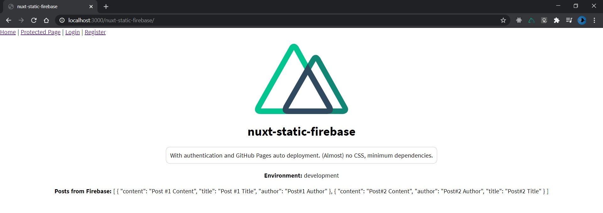

# nuxt-static-firebase

A <a href="https://nuxtjs.org/" target="_blank">Nuxt.js</a> static website **starter kit** with Firebase/Firestore database. Includes basic authentication and auto deployment to GitHub Pages on every push to master branch through GitHub Actions. **Free Hosting and deployment!** Ideal for small to medium-sized projects.



## Build Setup

```bash
# install dependencies
$ npm install

# serve with hot reload at localhost:3000/nuxt-static-firebase/
$ npm run dev
```

## Configuration

Add your own personal Firebase configuration variables in `.env.example` and save file as `.env`. Firebase config variables can be retrieved from your Firebase project parameters page. Also add the exact same variables as GitHub secrets for the live website:


## Dependencies

- <a href="https://www.npmjs.com/package/firebase" target="_blank">Firebase</a>
- <a href="https://firebase.nuxtjs.org/guide/getting-started/" target="_blank">@nuxtjs/Firebase</a>

## Live website

Demo <a href="https://jeanquark.github.io/nuxt-static-firebase/" target="_blank">here</a>.
For your own website, visit <ins>https://\<your-github-username>/github.io/nuxt-static-firebase</ins>.

## Custom domain

GitHub Pages allows you to configure a custom domain for your website. Learn more <a href="https://docs.github.com/en/github/working-with-github-pages/configuring-a-custom-domain-for-your-github-pages-site" target="_blank">here</a>.

## Author

<a href="https://jmkleger.com" target="_blank">Jean-Marc Kleger</a>