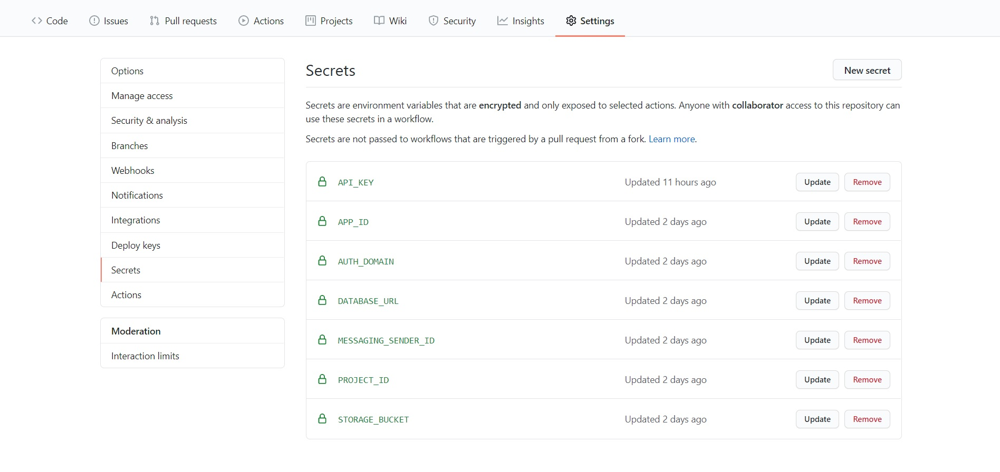

# nuxt-static-firebase

A [Nuxt.js](https://nuxtjs.org/) static website **starter kit** with Firebase/Firestore database. Includes basic authentication and auto deployment to GitHub Pages on every push to master branch through GitHub Actions. **Free Hosting and deployment!** Ideal for small to medium-sized projects.


## Build Setup

```bash
# install dependencies
$ npm install

# serve with hot reload at localhost:3000/nuxt-static-firebase/
$ npm run dev
```

## Configuration

Add your own personal Firebase configuration variables in `.env.example` and save file as `.env`. Firebase config variables can be retrieved from your Firebase project parameters page. Also add the exact same variables as GitHub secrets for the live website:



## Dependencies

- [Firebase](https://www.npmjs.com/package/firebase)
- [@nuxtjs/Firebase](https://firebase.nuxtjs.org/guide/getting-started/)

## Live website

Demo [here](https://jeanquark.github.io/nuxt-static-firebase/).
For your own website, visit <ins>https://\<your-github-username>/github.io/nuxt-static-firebase</ins>.

## Custom domain

GitHub Pages allows you to configure a custom domain for your website. Learn more [here](https://docs.github.com/en/github/working-with-github-pages/configuring-a-custom-domain-for-your-github-pages-site).

## Author

[Jean-Marc Kleger](https://jmkleger.com)